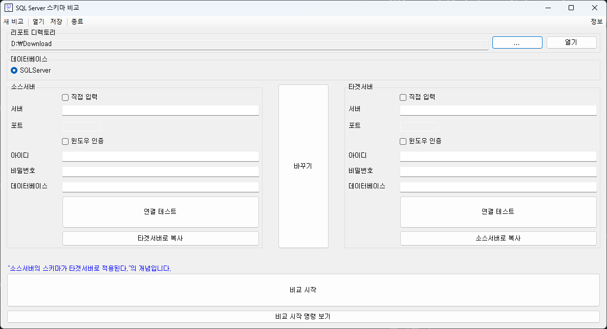

# XProject.Database.XYZ

데이터베이스 자잘한 도구 모음

- 데이터베이스 스키마 비교를 위한 UI.

## 바로 실행

- [다운로드 - Version 20240520](https://github.com/kjyoffice/XProject.Database.XYZ/releases)
- 압축 해제
- 실행, XProject.Database.SchemaCompare.UI.exe

## 빌드

- [VisualStudio 2022 Community or Higher](https://visualstudio.com/)
- .NET Framework 4.8.1
- 솔루션 파일, XProject.Database.XYZ.sln 열기
- 프로젝트, XProject.Database.SchemaCompare.UI 를 시작 프로젝트로 설정
- 빌드
- 실행

## 권장 프로그램

- [Visual Studio Code](https://code.visualstudio.com/)

## 주절주절

- 다른 데이터베이스, MySQL PostgreSQL도 스키마 비교를 위해 UI를 해뒀지만 각 데이터베이스의 시스템 쿼리를 거의 알지 못해서 UI에서 비활성화 해둠. 🙄

